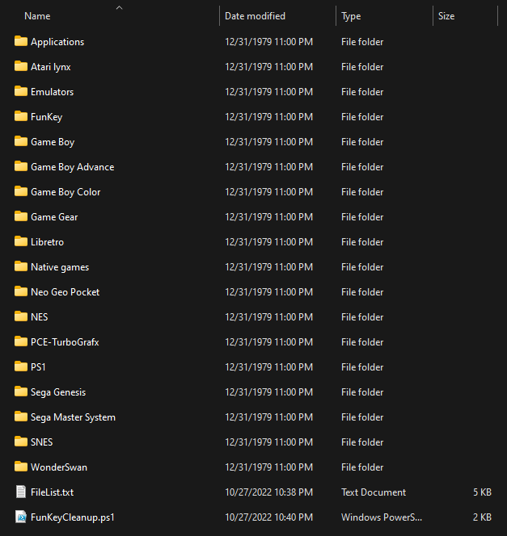

# FunKeyCleanup

 A short script that removes pre-installed games that come with the FunKey OS.

 ## Instructions

 1. Place the FunKeyCleanup.ps1 file and the FileList.txt file in the root folder for the FunKey

    It should look something like this

    

 2. Right click this file and select "Run with PowerShell"

 ## Notable Information

 The files that are currently being cleaned out of the system can be seen in the FileList.txt file. If there's a default file you'd like to not remove, please take it out of the list before running!

 ## Links

 [FunKey Main Page](https://www.funkey-project.com/)  
 [FunKey Store](https://funkey-project.myshopify.com/collections/frontpage)  
 [FunKey Discord](https://discord.com/invite/u84XEhqzJF)  
 [FunKey OS](https://github.com/FunKey-Project/FunKey-OS)  
 [DrUm78 FunKey OS Fork](https://github.com/DrUm78/FunKey-OS/releases)  
